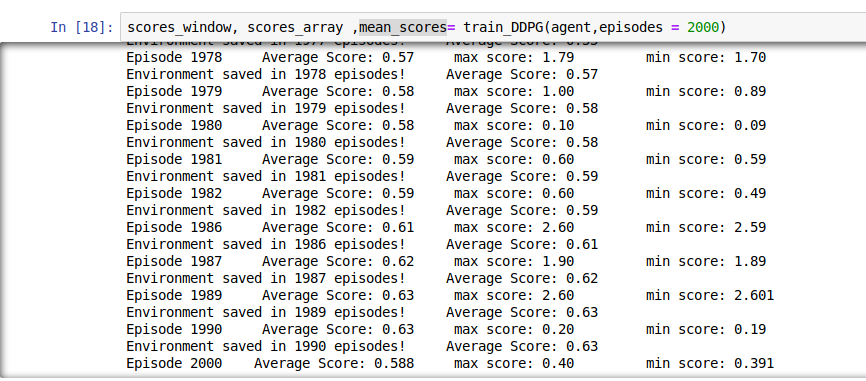

# Continuous control with DDPG
 ## how the DDPG works:
 the Qnetwork consiste of 4 networks 2 are the same we call them actor (local and target actor) used to predict the action of the state s , and ther 2 networks of the same architecture we call them the critic networks, and as the actors networks one is local and the 2nd is the target, we train the local one and after some steps of training we update the target one.  

and we use the **MSE** function to calculate the difference between the target and the predicted .

 ## network description  

in the first of this challange i tried with a big architecteur with 6 layers and a small number of unites, after some episode i found out that this architector donesn't help the agent to learn at all. so after different networks, i found out that a small network with a big number of hidden unites helps very well. so i worked with the same architecture in the actor and critic networks with 3 hiden layers of 120,128,130 unites.

## the training and the re  sults 
in my project i used this paramaters 
> BUFFER_SIZE = int(1e5)   : i used a buffer of a big size to collect as many simples as i can

> BATCH_SIZE = 128   : a big batch size gave a good values in this case, it alows the network to lean from a lot of expeincies in one time  

> GAMMA = 0.99  : it's some how a big value to let the network focus on all the actions.
> TAU = 0.003  

> LEARN_EVERY = 1 i found out that set the update value to 1 helps a a lot

> LR_actor = 1e-5

> LR_critic = 1e-4               

and i got an avrege of rewards equal to 35  just after  episodes 110.

  

and the plot of rewards is 

  

## future work
this project can be improved in many sides.
- 1 - train the network more to get better rewards
- 2 - try different architecteur and find a better network that learn faster 
